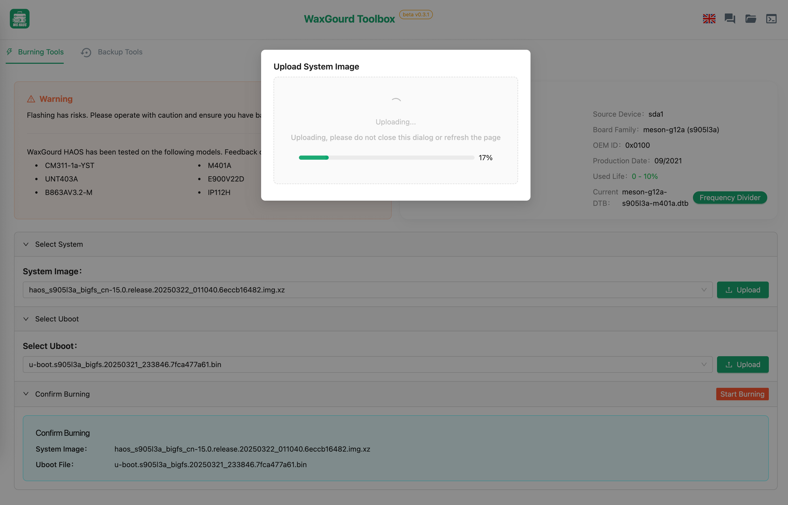
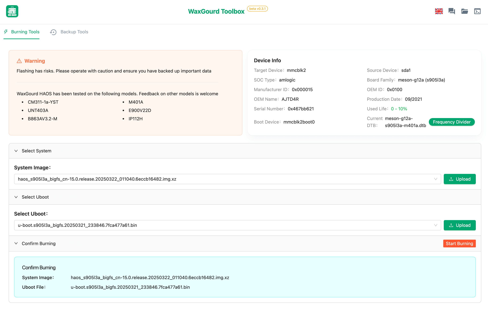
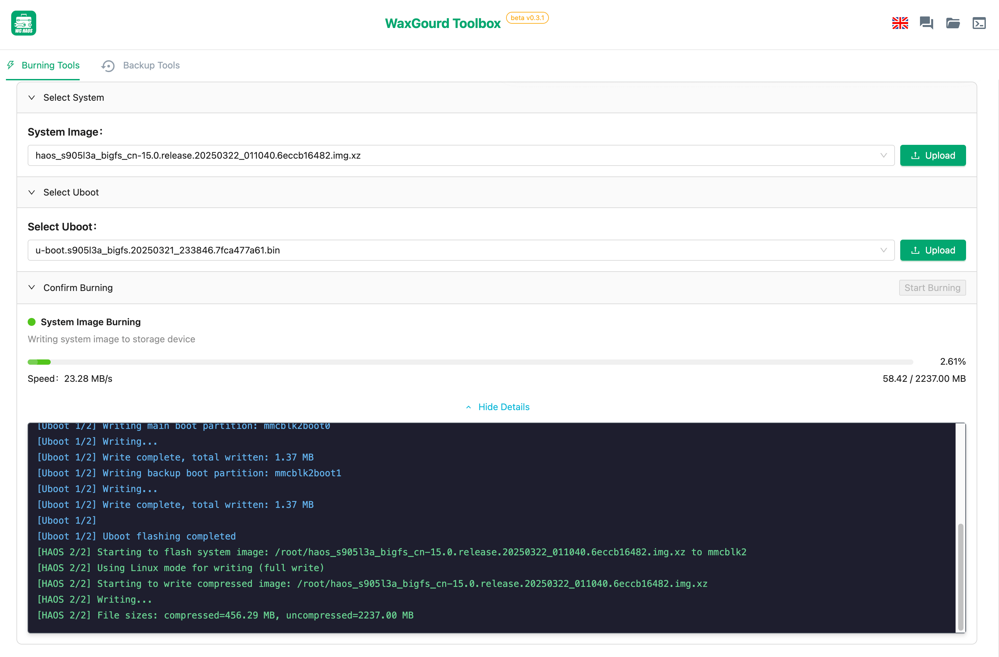
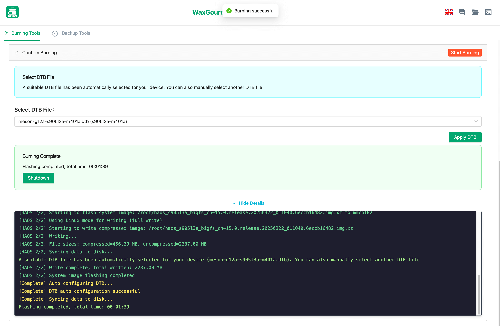
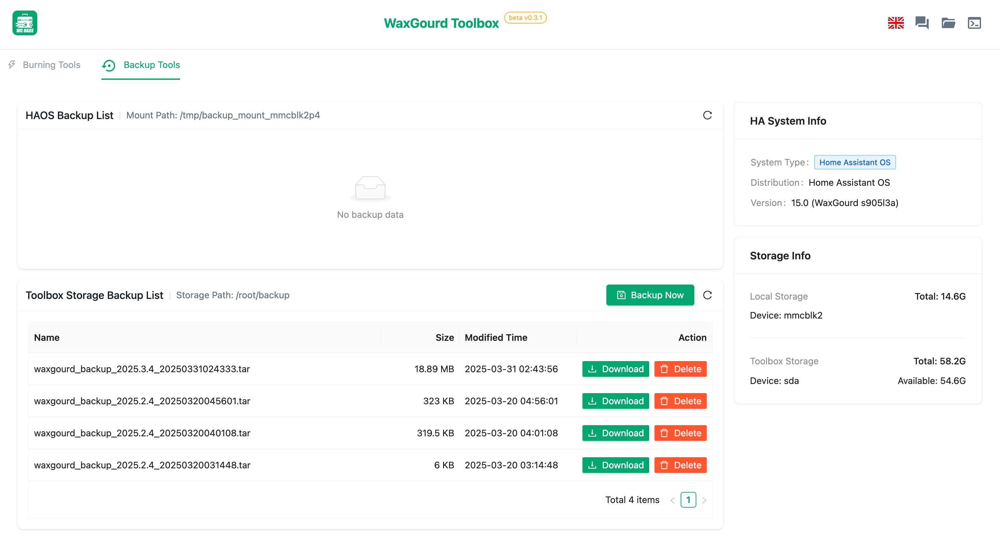

<div align="center"> 

<h1>WaxGourd Toolbox</h1>
</div>

[中文](./README.md) | **English**

## Project Overview

WaxGourd Toolbox is a comprehensive management utility specifically designed for Debian systems. It seamlessly integrates multiple essential functions including HAOS system flashing, Home Assistant configuration backup and restoration, add-on management, and more. This all-in-one solution provides users with powerful device management capabilities through an intuitive and user-friendly web interface, eliminating the need for complex command-line operations.

## Quick Start

### Installation

#### Via Debian Package (Recommended)

```shell
sudo dpkg -i wa-tools-[version]-arm64.deb

# Check service status
sudo systemctl status wa-tools.service
```

## Core Features

### System Flashing

- Comprehensive support for firmware flashing across various device models
- Intelligent automatic recognition of device models and firmware types
- Secure and stable flashing process with real-time progress monitoring
- Complete support for uboot file management and installation
- Specialized DTB frequency reduction optimization for compatible devices

### System Backup & Restoration

- Complete Home Assistant system backup and restoration capabilities
- Flexible custom selection of system components and add-ons for backup
- Streamlined management and download of historical backup archives
- Seamless export of backup data to external storage devices

### Device Management

- Comprehensive real-time monitoring of device status and performance
- Detailed visualization of partition layouts and disk information
- One-click system restart and secure shutdown controls
- Advanced system parameter optimization (including storage I/O frequency adjustment)

### File Management

- Intuitive file system navigation and management interface
- High-speed file upload and download functionality
- Enterprise-grade support for large file chunked uploads

## Preview

### System Flashing

<div align="center">

<p><strong>Firmware Upload Interface</strong></p>

<p><strong>Device Flashing Information</strong></p>

<p><strong>Flashing Progress Display</strong></p>

<p><strong>Flashing Completion Interface</strong></p>
</div>

### System Backup

<div align="center">

<p><strong>System Backup Interface</strong></p>
</div>

Upon completion of the backup process, the system generates a downloadable tar archive. Users can import this archive into any installed Home Assistant system by accessing the management interface through port 8123, enabling effortless restoration of selected system configurations and add-ons.

## FAQ

1. **Service fails to start?**

   - Review the detailed log file at: `/var/log/wa-tools/server.log`
   - Verify that all configuration file paths are correctly specified
   - Ensure the service user has sufficient system permissions

2. **Cannot access the Web management interface?**

   - Confirm the service is running properly: `systemctl status wa-tools.service`
   - Verify that port 8122 is properly opened in your firewall settings
   - Check that the device has a stable network connection

3. **System flashing operation failed?**

   - Ensure the device is properly connected and recognized by the system
   - Verify the integrity and compatibility of the firmware file
   - Confirm that your device model fully supports the selected firmware version

4. **Home Assistant system fails to start after flashing?**
   - Ensure you've selected the correct DTB file matching your specific device
   - Try flashing an alternative uboot version separately
