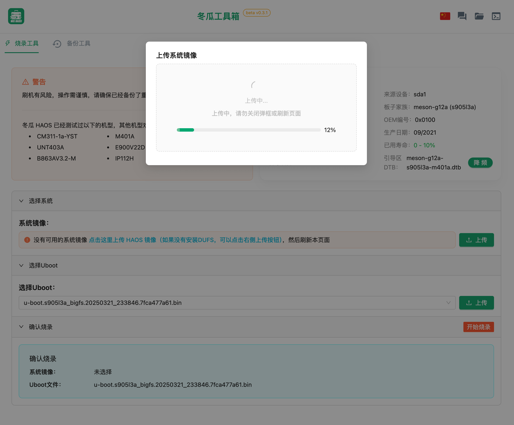
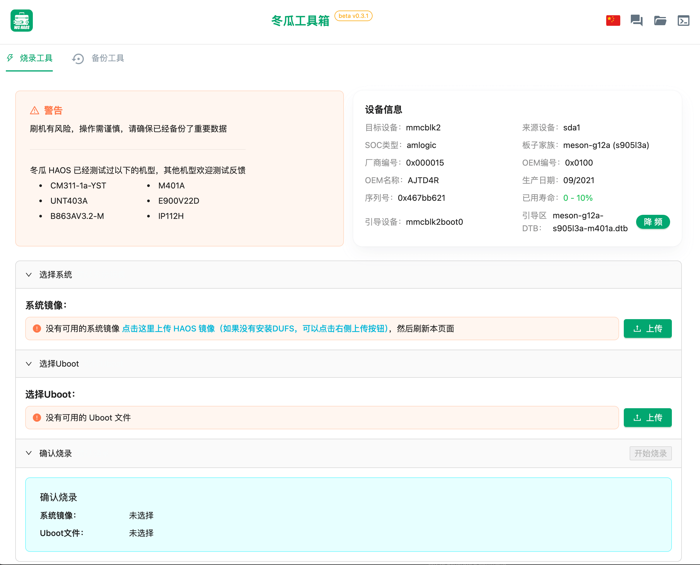
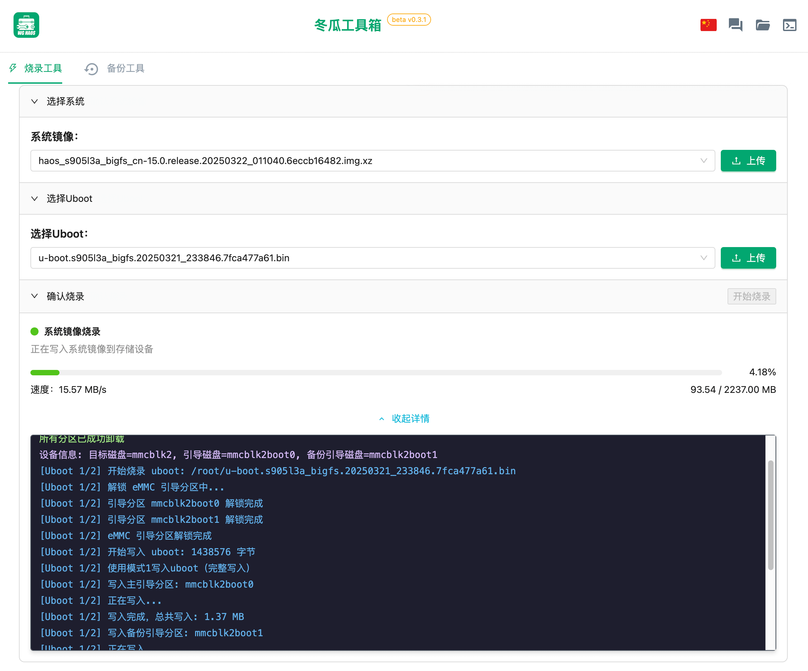
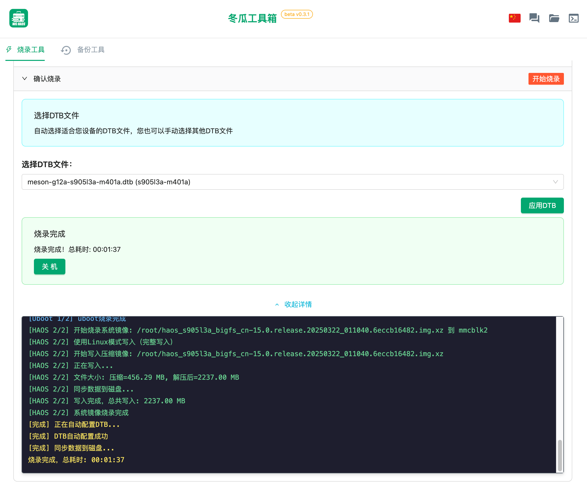
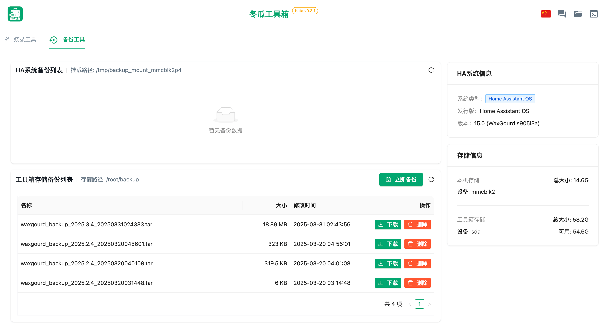

<div align="center"> 

<h1>冬瓜工具箱</h1>
</div>

**中文** | [English](./README.En.md)

## 项目概述

冬瓜工具箱是一款专为 Debian 系统开发的高效管理工具，集成了 HAOS 系统烧录、Home Assistant 配置备份与恢复、加载项管理等多种功能于一体，为用户提供设备烧录 HA 固件等解决方案。通过直观友好的 Web 界面，用户无需掌握复杂的命令行操作，即可轻松完成各类任务。

## 快速开始

### 安装方式

#### 通过 Debian 包安装（推荐）

```shell
sudo dpkg -i wa-tools-[版本]-arm64.deb
sudo systemctl enable wa-tools.service
sudo systemctl start wa-tools.service

# 查看服务状态
sudo systemctl status wa-tools.service
```

## 核心功能

### 系统烧录

- 全面支持多种设备型号的固件烧录
- 智能识别设备型号与固件类型
- 提供安全稳定的烧录流程与实时进度监控
- 完整支持 uboot 文件的烧录与管理
- 针对特定设备提供 dtb 降频优化功能

### 系统备份与还原

- 提供完整的 Home Assistant 系统备份与恢复功能
- 灵活支持自定义选择备份系统组件与加载项
- 集成历史备份文件的便捷管理与下载功能
- 支持将备份数据导出至外部存储设备

### 设备管理

- 全面的设备状态实时监控
- 详细的分区与磁盘信息可视化展示
- 便捷的系统重启与安全关机控制
- 专业的系统参数优化（如存储读写频率调节）

### 文件管理

- 简洁高效的文件系统浏览与管理
- 快速的文件上传与下载功能
- 强大的大文件分片上传支持

## 预览

### 系统烧录功能

<div align="center">

<p><strong>固件上传界面</strong></p>

<p><strong>设备烧录信息</strong></p>

<p><strong>烧录进度展示</strong></p>

<p><strong>烧录完成界面</strong></p>
</div>

### 系统备份功能

<div align="center">

<p><strong>系统备份界面</strong></p>
</div>

备份完成后，系统将生成可下载的 tar 压缩包。用户可以将此压缩包导入到任何已安装的 Home Assistant 系统中，通过访问 8123 端口的管理界面，轻松恢复所选的系统配置与加载项。

## 常见问题解答

1. **服务无法正常启动？**

   - 查看详细日志文件：`/var/log/wa-tools/server.log`
   - 验证配置文件路径设置是否正确
   - 检查服务用户权限是否充足

2. **无法访问 Web 管理界面？**

   - 确认服务运行状态：`systemctl status wa-tools.service`
   - 检查防火墙是否已开放 8122 端口
   - 验证设备网络连接是否正常

3. **系统烧录操作失败？**

   - 确认设备连接状态是否正常
   - 检查固件文件的完整性与兼容性
   - 验证所选设备是否支持当前固件版本

4. **烧录完成后 Home Assistant 系统无法启动？**
   - 确保已为设备选择匹配的 dtb 文件
   - 尝试选择其他版本的 uboot 进行单独烧录
